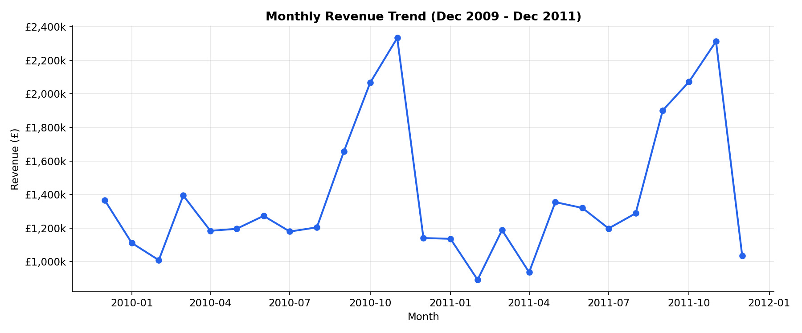
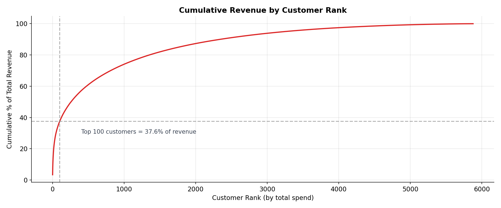
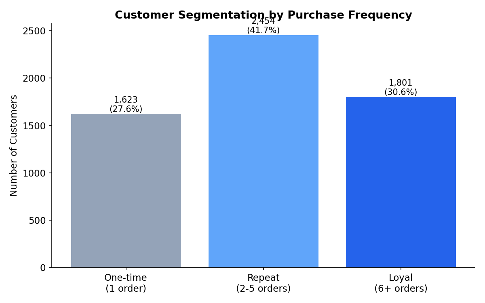

# UK Online Retail Sales Analysis

## Overview
Analysis of ~1 million transactions from a UK-based online retailer (Dec 2009–Dec 2011) to identify revenue trends, customer value, retention patterns, and churn risk. This project demonstrates SQL proficiency (CTEs, window functions, aggregations), data cleaning with Python/pandas, and business-focused analytical thinking.

## Data Source
[Online Retail II dataset](https://archive.ics.uci.edu/dataset/502/online+retail+ii) — UCI Machine Learning Repository. Real transactional data from a UK-registered online gift retailer, covering ~43 countries.

## Data Cleaning
Starting from 1,067,371 raw transaction rows, the following cleaning steps were applied:
- Removed 243,007 rows with missing `Customer ID` (cannot be attributed to a customer for segmentation/retention analysis)
- Removed 4,382 rows with missing product `Description`
- Removed 34,335 duplicate rows
- Separated 19,494 cancelled orders (`Invoice` starting with 'C') into a dedicated `cancellations` table — treated as valid business data (returns), not discarded
- Removed rows with negative or zero `Price` (6,207 rows) — likely data entry errors or write-offs, not genuine sales
- Final clean dataset: **779,425 transaction rows**

Cleaning was performed in Python (pandas), with the cleaned data loaded into PostgreSQL for analysis.

## Key Insights

### 1. Revenue Seasonality
Revenue rises sharply from September and peaks in November (£1.03M–£1.17M) in both 2010 and 2011, consistent with Christmas gift-buying behaviour. February is consistently the weakest month. This suggests inventory and marketing spend should ramp up from September to capture peak seasonal demand.

### 2. Customer Revenue Concentration
The top 100 customers (out of ~5,900 total) account for 37.6% of total revenue, with the single highest-spending customer contributing 3.3% alone. This concentration suggests the business would benefit from a formal key-account management or loyalty programme for top-tier customers, and should closely monitor churn risk within this small group, since losing even a handful would materially impact revenue.

### 3. Customer Retention
72.4% of customers are repeat buyers (2+ orders), with 30.6% classified as "loyal" (6+ orders). Only 27.6% are one-time purchasers. This indicates a strong underlying retention base, suggesting future efforts should focus on converting one-time buyers into repeat customers rather than fixing a broad retention problem.

### 4. Top Products Vary by Country
"WHITE HANGING HEART T-LIGHT HOLDER" and "REGENCY CAKESTAND 3 TIER" are consistent bestsellers across the UK and Germany. Notably, "POSTAGE" and "Manual" appear as top revenue lines for France and Germany — these are administrative entries, not products, and were flagged as a data quality consideration rather than a genuine sales insight. A production analysis would exclude these from product-performance reporting.

### 5. RFM Segmentation Identifies Churn Risk
RFM (Recency, Frequency, Monetary) segmentation showed most top-spending customers are "Champions" — recent, frequent, high-value buyers. However, the analysis also surfaced a high-value outlier: customer 12346, who has spent £77,556 historically but hasn't purchased in 325 days, flagging them as a lapsed high-value customer worth targeted re-engagement.

## Interactive Dashboard
An interactive Tableau dashboard was built on top of this same dataset, bringing the key findings above into a single, filterable view — including KPI summary cards, the monthly revenue trend, top 10 customers, and top international markets. Clicking a point on the revenue trend line filters the other charts to that month.

**[View the live interactive dashboard on Tableau Public →](https://public.tableau.com/app/profile/yunusa.jibrin/viz/UKOnlineRetailSalesDashboard_17837109361810/Dashboard1?publish=yes)**

## Summary
This analysis of ~780,000 UK online retail transactions revealed strong seasonal demand (peaking in November), a healthy customer retention profile (72% repeat purchase rate), and meaningful revenue concentration among top customers (top 100 customers = 37.6% of revenue). RFM segmentation further identified specific high-value customers at risk of churn, providing a basis for targeted retention campaigns. These findings were also brought together in an interactive Tableau dashboard for at-a-glance, filterable exploration.

## Tools Used
- **PostgreSQL** — data storage and querying
- **SQL** — CTEs, window functions (`RANK`, `ROW_NUMBER`, `NTILE`, `SUM() OVER()`), aggregations, `CASE` segmentation
- **Python (pandas)** — data cleaning and preparation
- **DBeaver** — database management and query execution
- **Tableau Public** — interactive dashboard and data visualization

## Files
- `analysis_queries.sql` — all SQL queries with business context comments
- `data_cleaning.ipynb` — Python data cleaning and preparation notebook
- `visualizations.ipynb` — connects to PostgreSQL and generates the charts below
- `chart_monthly_revenue.png`, `chart_revenue_concentration.png`, `chart_customer_segments.png` — supporting charts
- `UK Retail Dashboard.png` — screenshot of the interactive Tableau dashboard
- `README.md` — this file

## Next Steps
Potential extensions to this analysis include: building an equivalent Power BI dashboard, forecasting future monthly revenue, and running a full RFM segmentation across the entire customer base (not just top spenders) to build a prioritised churn-prevention target list.